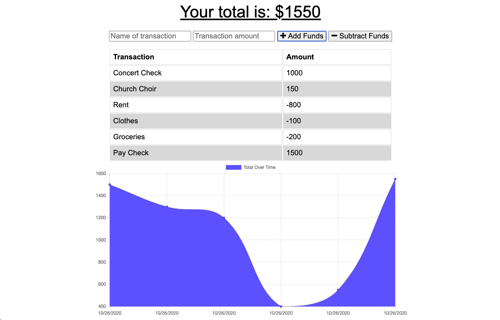
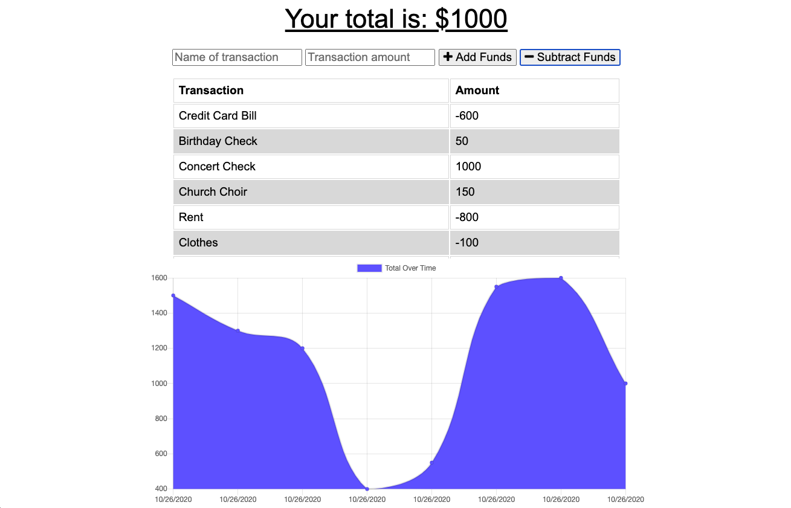
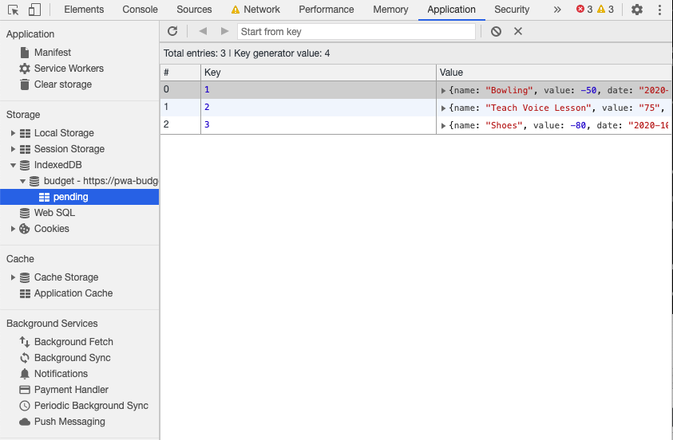
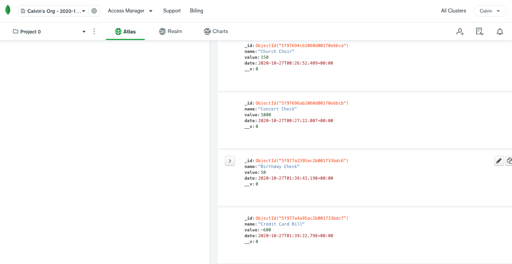
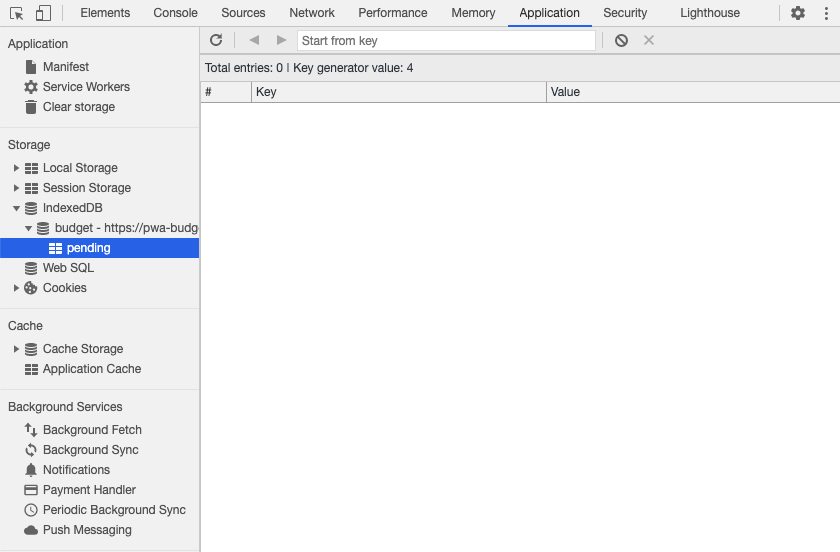
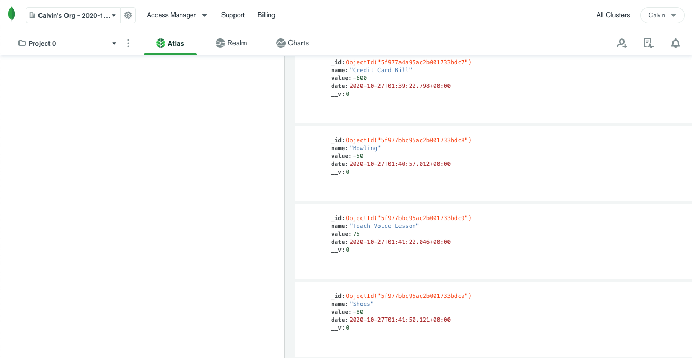

# pwa-budget332

## Description

In this application, I have added functionality to an existing Budget Tracker application to allow for offline access and functionality.  The user is be able to add expenses and deposits to their budget with or without an internet connection. When entering transactions offline, they are saved and populate the total when brought back online. 

## Table of Contents

* [Installation](#installation)
* [Usage](#usage)
* [License](#license)
* [Contributing](#Contributing)
* [Tests](#tests)
* [Questions](#questions)

## Installation

All you need to do is click the link.

## Usage

When the user opens the app, they are presented with their current budget.  

They are able to add transactions by entering values and clicking either Add or Subtract Funds.  

The user can also use this app without an internet connection.  Any transactions made online will be saved in pending IndexedDB. 

The new information has not yet been added to the database.

Once the user is back online, when they reload the page twice, those transactions will be added to the MongoDB Atlas DB.  The pending entries are now gone.

The new values have now been added to the database.

## License

This project is covered under the MIT License.  
Copyright (c) [2020] [Calvin Griffin]  
Permission is hereby granted, free of charge, to any person obtaining a copy of this software and associated documentation files (the "Software"), to deal in the Software without restriction, including without limitation the rights to use, copy, modify, merge, publish, distribute, sublicense, and/or sell copies of the Software, and to permit persons to whom the Software is furnished to do so, subject to the following conditions:
The above copyright notice and this permission notice shall be included in all copies or substantial portions of the Software.
THE SOFTWARE IS PROVIDED "AS IS", WITHOUT WARRANTY OF ANY KIND, EXPRESS OR IMPLIED, INCLUDING BUT NOT LIMITED TO THE WARRANTIES OF MERCHANTABILITY, FITNESS FOR A PARTICULAR PURPOSE AND NONINFRINGEMENT. IN NO EVENT SHALL THE AUTHORS OR COPYRIGHT HOLDERS BE LIABLE FOR ANY CLAIM, DAMAGES OR OTHER LIABILITY, WHETHER IN AN ACTION OF CONTRACT, TORT OR OTHERWISE, ARISING FROM, OUT OF OR IN CONNECTION WITH THE SOFTWARE OR THE USE OR OTHER DEALINGS IN THE SOFTWARE.

## Contributing

Please contact me if you would like to contribute.

## Tests

Open it up and give it a spin.

## Questions

If you have any additional questions, please contact me via email or GitHub by clicking the links below.

Email: cgriffin332@gmail.com  
GitHub: https://github.com/cgriffin332
